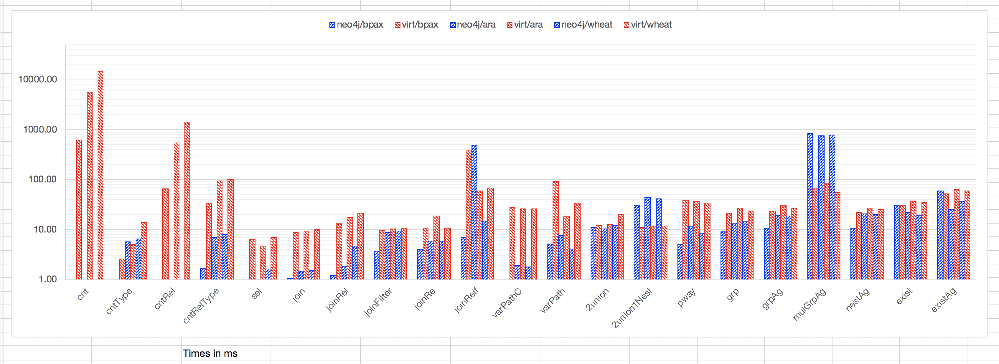
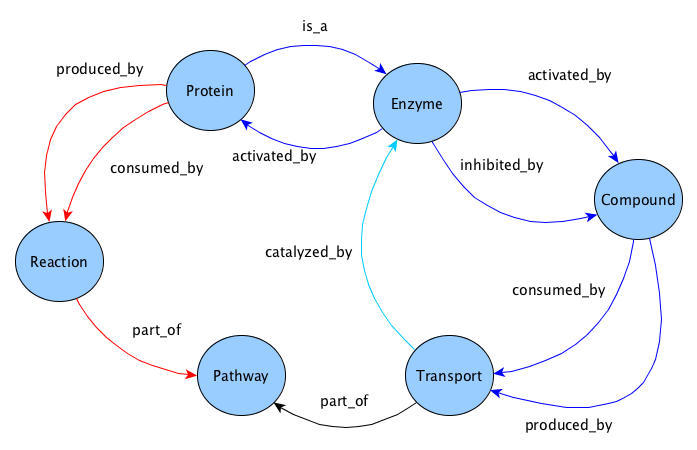

# Benchmarking kNetMiner Data, Neo4j vs Virtuoso

This module is used to perform tests with [KnetMiner](http://knetminer.rothamsted.ac.uk/) data, encoded either as RDF 
or Neo4j, by means of the [rdf2pg tool](https://github.com/Rothamsted/rdf2pg).

An [older version](/Rothamsted/graphdb-benchmarks/releases/tag/swat4ls18) of this work was presented with our [paper presented at SWAT4HCLS 2018](https://figshare.com/articles/Getting_the_best_of_Linked_Data_and_Property_Graphs_rdf2neo_and_the_KnetMiner_Use_Case/7314323). 
A [presentation](https://www.slideshare.net/mbrandizi/swat4l-2018brandizi) from the workshop is also available.

## Contents

  * [Contents](#contents)
  * [Test Results](#test-results)
    * [Figure 1: Loading Performance](#figure-1-loading-performance)
    * [Figure 2: Query Performance](#figure-2-query-performance)
  * [Test Conditions](#test-conditions)
  * [Test Approach](#test-approach)
  * [Test Data Sets](#test-data-sets)
  * [Queries](#queries)
    * [Figure 3: Graph Pattern Used with Test Queries](#figure-3-graph-pattern-used-with-test-queries)
    * [Query List](#query-list)
    

## Test Results

Results are summarised in the following figures. It is recommended that you first read this hereby document.
See this [Excel file](results/gdb_benchmark_results.xlsx) for details. 

Click on the images to see a bigger version.

### Figure 1: Loading Performance

### Figure 2: Query Performance

A detailed table is [here](results/query_results_table.png).

## Test Conditions

  * Hardware: MacBook Pro, 2.9 GHz Intel Core i7, 16GB RAM
  * Both the servers and the client (this package) are run on the same computer, thus network latency is minimsed
  * Only one server at a time is on while running a test of a given type (Neo4j/Virtuoso)

## Test Approach

  * For each database (Neo4/Virtuoso) a number of query typed is tested (see below). For each query type  a Cypher
  and a SPARQL version were written, aiming at keeping the same or very similar semantics, as well as similar
  graph patterns and other language constructs known to affect the database performance (e.g., filters, `ORDER BY` clauses).

  * Queries were written considering:
  	* the typical query needs for our data
  	* the aim to test particular query language operations and features
  	* taking example from existing benchmarks (e.g., `nestAg`)
  	* Certain queries are instantiated with parameters at each execution (e.g., `joinFilter` retrieves proteins by name,
  	the name is a required parameter). For those cases, files with predefined parameter valued were prepared (taking values
  	from the database). Every time the query has to be executed, a value is picked randomly and injected into the query.
    * Queries were written by first defining a data retrieval goal and then writing an implementation in both Cypher and 
    SPARQL matching the goal as much as possible. Moreover, the respective language constructs we have used are chosen 
    trying to replicate similar graph pattern structures and similar database engine challenges 
    (e.g., [2union1Nest(results/src/main/assembly/resources/cypher/0130_2union1Nest.cypher) could be written by 
    replicating branches, rather than unifying them with multiple WITH clauses, but the result would be significantly 
    different than the corresponding SPARQL and would not contain the nested unions that the query is supposed to test).

  * There are two test types: [Cypher](src/main/java/uk/ac/rothamsted/rdf/benchmarks/CypherProfiler.java) and
	[Sparql](src/main/java/uk/ac/rothamsted/rdf/benchmarks/SparqlProfiler.java), which are run separately.
	Every test type is based on the procedure:

    1. The Database server is started
    1. A number of predefined iterations (usually a few thousands) are run, for each iteration:
      1. a query is randomly selected from the set of competence ([Cypher](src/main/assembly/resources/cypher),
			or [SPARQL](src/main/assembly/resources/sparql))
      1. if it's a parametric query, a random parameter is chosen (see above)
      1. the query is run, the execution time is tracked. We track the time going from when the query string is sent to
      the server to when the first result is fetched. This includes network latency, which we want include in the
      evaluation, for several reasons:
      	1. network latency is a small overhead and comparable between the two datbase engines (our primary goal is to
      	compare the two)
      	1. in real use cases it is a relevant time
    1. At the end of all the iterations, the times of each query are averaged and results are reported.    

	* Repeating the queries is done to get an average behavoir, running them in random order avoids biases like the
  exploitation of caches. We are not testing the parallel performance (i.e., many clients running queries simultaneously)
  since we're interested in comparing speeds with respect to the query types.

## Test Data Sets

Each test type is run against database instances containing three different datasets:

  * BioPax: a small dataset with BioPAX and GeneOntology data.
    [RDF dump](https://tinyurl.com/y832jbxw). [Neo4j dump](https://tinyurl.com/ycukubme)
  * Arabidopsis: the kNetMiner data set about arabidopsis, medium size.
    [RDF dump](https://tinyurl.com/yd65w6a3). [Neo4j dump](https://tinyurl.com/y8pg6str)
  * Wheat: the kNetMiner data set about wheat, biggest size.
    [RDF dump](https://tinyurl.com/y9oz4zfj). [Neo4j dump](https://tinyurl.com/yd7beezu).

## Queries

All the queries listed below, and used in the tests, are based on the BioKNO ontology schematisation. Several of them
are based on the graph pattern in figure, which models biological pathway relations in BioKNO.

### Figure 3: Graph Pattern Used with Test Queries

 
### Query List

  1. **cnt**: Counts instances, [Cypher](src/main/assembly/resources/cypher/0010_cnt.cypher), [SPARQL](src/main/assembly/resources/sparql/0010_cnt.sparql)
  2. **cntType**: Instances of a given type, [Cypher](src/main/assembly/resources/cypher/0020_cntType.cypher), [SPARQL](src/main/assembly/resources/sparql/0020_cntType.sparql)
  3. **cntRel**: Count relations, [Cypher](src/main/assembly/resources/cypher/0030_cntRel.cypher), [SPARQL](src/main/assembly/resources/sparql/0030_cntRel.sparql)
  4. **cntRelType**: CountRelations of a given type, [Cypher](src/main/assembly/resources/cypher/0040_cntRelType.cypher), [SPARQL](src/main/assembly/resources/sparql/0040_cntRelType.sparql)
  5. **sel**: Select entity and properties, [Cypher](src/main/assembly/resources/cypher/0050_sel.cypher), [SPARQL](src/main/assembly/resources/sparql/0050_sel.sparql)
  6. **join**: Simple Join, [Cypher](src/main/assembly/resources/cypher/0060_join.cypher), [SPARQL](src/main/assembly/resources/sparql/0060_join.sparql)
  7. **joinRel**: Join matching relation, [Cypher](src/main/assembly/resources/cypher/0070_joinRel.cypher), [SPARQL](src/main/assembly/resources/sparql/0070_joinRel.sparql)
  8. **joinFilter**: Simple join + attribute filter, [Cypher](src/main/assembly/resources/cypher/0080_joinFilter.cypher), [SPARQL](src/main/assembly/resources/sparql/0080_joinFilter.sparql)
  9. **joinRe**: Simple join + regex search, [Cypher](src/main/assembly/resources/cypher/0090_joinRe.cypher), [SPARQL](src/main/assembly/resources/sparql/0090_joinRe.sparql)
  10. **joinReif**: Join through relation property, [Cypher](src/main/assembly/resources/cypher/0095_joinReif.cypher), [SPARQL](src/main/assembly/resources/sparql/0095_joinReif.sparql)
  11. **varPathC**: Variable path query (max len), [Cypher](src/main/assembly/resources/cypher/0100_varPathC.cypher), [SPARQL](src/main/assembly/resources/sparql/0100_varPathC.sparql)
  12. **varPath**: Variable path query (unbound len and top restricted), [Cypher](src/main/assembly/resources/cypher/0110_varPath.cypher), [SPARQL](src/main/assembly/resources/sparql/0110_varPath.sparql)
  13. **2union**: 2 unions, no nesting, [Cypher](src/main/assembly/resources/cypher/0120_2union.cypher), [SPARQL](src/main/assembly/resources/sparql/0120_2union.sparql)
  14. **2union1Nest**: 2 unions, 1 nesting, [Cypher](src/main/assembly/resources/cypher/0130_2union1Nest.cypher), [SPARQL](src/main/assembly/resources/sparql/0130_2union1Nest.sparql)
  15. **2union1Nest+**: 2 unions, 1 nesting (with Cypher CALL), [Cypher](src/main/assembly/resources/cypher/0135_2union1Nest+.cypher), [SPARQL](src/main/assembly/resources/sparql/0135_2union1Nest+.sparql)
  16. **pway**: Complex union of paths over pathways, [Cypher](src/main/assembly/resources/cypher/0140_pway.cypher), [SPARQL](src/main/assembly/resources/sparql/0140_pway.sparql)
  17. **grp**: Group by, [Cypher](src/main/assembly/resources/cypher/0150_grp.cypher), [SPARQL](src/main/assembly/resources/sparql/0150_grp.sparql)
  18. **grpAg**: Group by + 2 aggregation functions, [Cypher](src/main/assembly/resources/cypher/0170_grpAg.cypher), [SPARQL](src/main/assembly/resources/sparql/0170_grpAg.sparql)
  19. **mulGrpAg**: Multiple subqueries having aggregations , [Cypher](src/main/assembly/resources/cypher/0180_mulGrpAg.cypher), [SPARQL](src/main/assembly/resources/sparql/0180_mulGrpAg.sparql)
  20. **nestAg**: Nested and outer aggregations (see Q6 from the [Berlin benchmark](https://goo.gl/v4YbQ2)), [Cypher](src/main/assembly/resources/cypher/0190_nestAg.cypher), [SPARQL](src/main/assembly/resources/sparql/0190_nestAg.sparql)
  21. **exist**: Not exists, [Cypher](src/main/assembly/resources/cypher/0200_exist.cypher), [SPARQL](src/main/assembly/resources/sparql/0200_exist.sparql)
  22. **existAg**: Not exists + aggregation, [Cypher](src/main/assembly/resources/cypher/0210_existAg.cypher), [SPARQL](src/main/assembly/resources/sparql/0210_existAg.sparql)
  