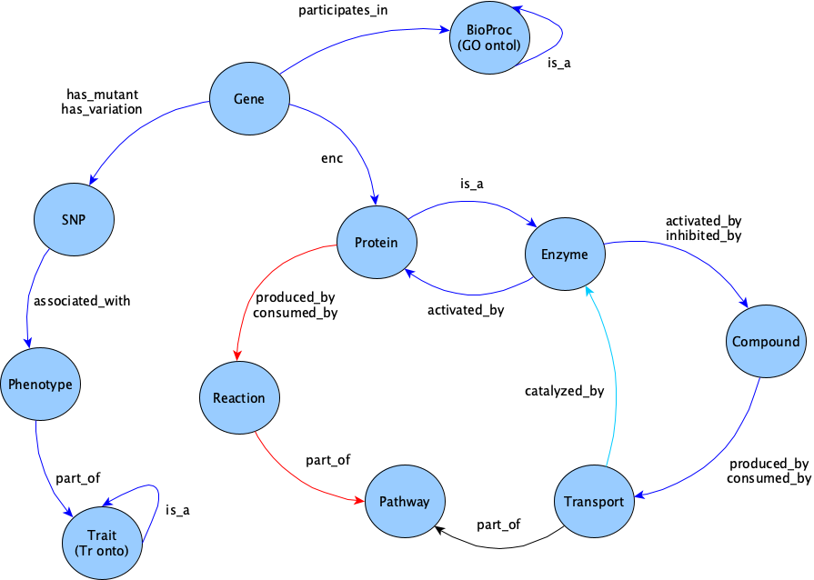

# Managing FAIR Knowledge Graphs as Polyglot and Data End Points: A Benchmark based on the rdf2pg Framework and Plant Biology Data   
 
This repository contains code to benchmark three different graph databases and graph query languages, against 
plant biology datasets, which are conceptually aligned (based on the same data model) in the different database/language flavours.

This is work by the [KnetMiner team][I4] and [Carlos Bobed][I5].

The alignment is produced by means of the [rdf2pg framework][I10], and this work contributes to assess the benefits of managing data in multiple data languages and formats, by means of our rdf2pg tools.

This work is an extension of [previous work by the KnetMiner team][I20], which we presented at [SWAT4LS 2018][I30] ([old presentation here][I40]).

[I4]: https://knetminer.com
[I5]: https://scholar.google.com/citations?user=ycIA_f4AAAAJ
[I10]: https://github.com/Rothamsted/rdf2pg
[I20]: /Rothamsted/graphdb-benchmarks/releases/tag/swat4ls18
[I30]: https://figshare.com/articles/Getting_the_best_of_Linked_Data_and_Property_Graphs_rdf2neo_and_the_KnetMiner_Use_Case/7314323
[I40]: https://www.slideshare.net/mbrandizi/swat4l-2018brandizi

## Test settings

We have tested three combinations of graph database, graph query language, data formats:

1. SPARQL on the Virtuoso triple store, dealing with RDF data (and the corresponding model).
1. Cypher on the Neo4j graph database, with data directly imported into the database from our rdf2neo tool.
1. Gremlin on ArcadeDB, with data imported from files in graphML format.

Details on the test settings used are in the [dataset loading results report][TS10].

## Test datasets

For each of the graph databases mentioned above, we have tested the loading and the query performance of three datasets:

1. Biopax: a small dataset, mostly containing data about the Arabidopsis model organisms, including 
   pathways from [AraCyc][DS10] and gene annotations from [Gene Ontology][DS20].
1. Arabidopsis: a medium-size dataset, containing more data about Arabidopsis, including AraCyc, Gene Ontology, gene annotations from [ENSEMBL Plants][DS30] and [TAIR][DS35], protein annotations from [UniProt][DS40], scientific publications from [PubMed][DS45].
1. Poaceae: a large dataset with integrated data about different cereals (wheat, rice and barley), obtained from a variety of sources, including the ones mentioned above, plus genome-wide study data from [AraGWAS][DS50] and more. Partial access to this dataset is available via [KnetMiner programmatic data access endpoints][DS60].

[DS10]: https://academic.oup.com/plphys/article/132/2/453/6111635?login=false
[DS20]: https://academic.oup.com/nar/article/32/suppl_1/D258/2505186?login=false
[DS30]: https://link.springer.com/protocol/10.1007/978-1-4939-3167-5_6
[DS35]: https://doi.org/10.1093/nar/gkm965
[DS40]: https://academic.oup.com/nar/article/43/D1/D204/2439939?login=false
[DS45]: https://doi.org/10.1073/pnas.98.2.381
[DS50]: https://doi.org/10.1093/nar/gkx954
[DS60]: https://knetminer.com/data

### Data schematisation

The figure below shows the main types contained in each dataset:

These model was encoded based on [BioKNO, an application ontology][TS20], defined within the KnetMiner platform, to represent the data we deal with in the KnetMiner platform. This models common plant biology entities, some specific pattern used by KnetMiner applications and mappings to existing biology ontology and life science standards.

[TS10]: results/loading-results.ipynb
[TS20]: https://github.com/Rothamsted/bioknet-onto

## Test approach

We have done two types of tests: 

### Data Loading tests

[Loading tests][TS10], where we tested the time taken to populate each dataset with each of the tested datasets. See the linked report for details

### Querying tests

After loading each dataset, we performed [querying tests][TA10], where, for each dataset, we tested all of the chosen databases and query languages, each time timing the same set of queries. More precisely, for each of the tested query languages, we wrote conceptually equivalent queries.

While "conceptually equivalent" is difficult to define precisely, informally, it means the best effort to search for data that have the same semantics and equivalent representations in the different technologies and formats being tested. It also means writing queries that, across different technologies, present similar levels of complexity and search engine challenges.

For example, where it is easy for Neo4 to return a node property or an empty value (because they are attached to the nodes), we have translated this as OPTIONAL matches in SPARQL (since looking for a resource property is a triple pattern like any other). 

[TA10]: results/querying-results.ipynb

## Test results

The (Jupyter-based) reports linked above has more test details and detailed results linked above.

## Query List

Like the data, the queries listed below are based on the already-mentioned [BioKNO ontology][TS20].
We have split the benchmark queries into categories that take into account both the query semantics and the kind of challenge it puts on the query engines.  

Regarding the semantic motif queries, these produce patterns that occur often in KnetMiner, when we want to associate genes to relevant other entities (such as encoded proteins, biological processes, publications about genes or processes). In practice, a semantic motif query is a 'chain' pattern, it tries to follow a linear path from a gene to another entity, through a known chain of relations (eg, Gene -> encodes -> Protein -> participates -> Process -> mentioend -> Publication). Details in the [KnetMiner Wiki][QL10] and in the [KnetMiner paper][QL20]
 

[QL10]: https://github.com/Rothamsted/knetminer/wiki/Semantic-Motif-Searching-in-Knetminer
[QL20]: https://onlinelibrary.wiley.com/doi/10.1111/pbi.13583
[QL100]: https://github.com/Rothamsted/graphdb-benchmarks/blob/master/src/test/java/uk/ac/rothamsted/rdf/benchmarks/QueryListTest.java

**WARNING**: *do not edit what follows! It is automatically generated via [this code][QL100].*

### Category: counts

Common counts of elements like number of nodes, number of relations, etc.

1. **cnt**: Counts instances, [SPARQL](src/main/assembly/resources/sparql/0010_cnt.sparql), [Cypher](src/main/assembly/resources/cypher/0010_cnt.cypher), [Gremlin](src/main/assembly/resources/gremlin/0010_cnt.gremlin)
1. **cntType**: Instances of a given type, [SPARQL](src/main/assembly/resources/sparql/0020_cntType.sparql), [Cypher](src/main/assembly/resources/cypher/0020_cntType.cypher), [Gremlin](src/main/assembly/resources/gremlin/0020_cntType.gremlin)
1. **cntRel**: Count relations, [SPARQL](src/main/assembly/resources/sparql/0030_cntRel.sparql), [Cypher](src/main/assembly/resources/cypher/0030_cntRel.cypher), [Gremlin](src/main/assembly/resources/gremlin/0030_cntRel.gremlin)
1. **cntRelType**: Count relations of a given type, [SPARQL](src/main/assembly/resources/sparql/0040_cntRelType.sparql), [Cypher](src/main/assembly/resources/cypher/0040_cntRelType.cypher), [Gremlin](src/main/assembly/resources/gremlin/0040_cntRelType.gremlin)

### Category: selects

Queries that selects elements, including simple joins.

1. **sel**: Select entity and properties, [SPARQL](src/main/assembly/resources/sparql/0050_sel.sparql), [Cypher](src/main/assembly/resources/cypher/0050_sel.cypher), [Gremlin](src/main/assembly/resources/gremlin/0050_sel.gremlin)
1. **join**: Simple Join, [SPARQL](src/main/assembly/resources/sparql/0060_join.sparql), [Cypher](src/main/assembly/resources/cypher/0060_join.cypher), [Gremlin](src/main/assembly/resources/gremlin/0060_join.gremlin)
1. **joinRel**: Join literal properties of reified relations, [SPARQL](src/main/assembly/resources/sparql/0070_joinRel.sparql), [Cypher](src/main/assembly/resources/cypher/0070_joinRel.cypher), [Gremlin](src/main/assembly/resources/gremlin/0070_joinRel.gremlin)
1. **joinFilter**: Simple join + attribute filter, [SPARQL](src/main/assembly/resources/sparql/0080_joinFilter.sparql), [Cypher](src/main/assembly/resources/cypher/0080_joinFilter.cypher), [Gremlin](src/main/assembly/resources/gremlin/0080_joinFilter.gremlin)
1. **joinRe**: Simple join + regex search, [SPARQL](src/main/assembly/resources/sparql/0090_joinRe.sparql), [Cypher](src/main/assembly/resources/cypher/0090_joinRe.cypher), [Gremlin](src/main/assembly/resources/gremlin/0090_joinRe.gremlin)
1. **joinReif**: Join through relation property, [SPARQL](src/main/assembly/resources/sparql/0095_joinReif.sparql), [Cypher](src/main/assembly/resources/cypher/0095_joinReif.cypher), [Gremlin](src/main/assembly/resources/gremlin/0095_joinReif.gremlin)

### Category: unions

Queries that perform graph pattern and subquery unions.

1. **2union**: 2 unions, no nesting, [SPARQL](src/main/assembly/resources/sparql/0120_2union.sparql), [Cypher](src/main/assembly/resources/cypher/0120_2union.cypher), [Gremlin](src/main/assembly/resources/gremlin/0120_2union.gremlin)
1. **2union1Nest**: 2 unions, 1 nesting, [SPARQL](src/main/assembly/resources/sparql/0130_2union1Nest.sparql), [Cypher](src/main/assembly/resources/cypher/0130_2union1Nest.cypher), [Gremlin](src/main/assembly/resources/gremlin/0130_2union1Nest.gremlin)
1. **2union1Nest+**: 2 unions, 1 nesting (with Cypher CALL), [SPARQL](src/main/assembly/resources/sparql/0135_2union1Nest+.sparql), [Cypher](src/main/assembly/resources/cypher/0135_2union1Nest+.cypher), [Gremlin](src/main/assembly/resources/gremlin/0135_2union1Nest+.gremlin)
1. **pway**: Complex union of paths over pathways, [SPARQL](src/main/assembly/resources/sparql/0140_pway.sparql), [Cypher](src/main/assembly/resources/cypher/0140_pway.cypher), [Gremlin](src/main/assembly/resources/gremlin/0140_pway.gremlin)
1. **exist**: Not exists, [SPARQL](src/main/assembly/resources/sparql/0200_exist.sparql), [Cypher](src/main/assembly/resources/cypher/0200_exist.cypher), [Gremlin](src/main/assembly/resources/gremlin/0200_exist.gremlin)
1. **existAg**: Not exists + aggregation, [SPARQL](src/main/assembly/resources/sparql/0210_existAg.sparql), [Cypher](src/main/assembly/resources/cypher/0210_existAg.cypher), [Gremlin](src/main/assembly/resources/gremlin/0210_existAg.gremlin)

### Category: aggregation

Queries that perform data grouping and aggregations.

1. **grp**: Group by, [SPARQL](src/main/assembly/resources/sparql/0150_grp.sparql), [Cypher](src/main/assembly/resources/cypher/0150_grp.cypher), [Gremlin](src/main/assembly/resources/gremlin/0150_grp.gremlin)
1. **grpAg**: Group by + 2 aggregation functions, [SPARQL](src/main/assembly/resources/sparql/0170_grpAg.sparql), [Cypher](src/main/assembly/resources/cypher/0170_grpAg.cypher), [Gremlin](src/main/assembly/resources/gremlin/0170_grpAg.gremlin)
1. **mulGrpAg**: Multiple subqueries having aggregations , [SPARQL](src/main/assembly/resources/sparql/0180_mulGrpAg.sparql), [Cypher](src/main/assembly/resources/cypher/0180_mulGrpAg.cypher), [Gremlin](src/main/assembly/resources/gremlin/0180_mulGrpAg.gremlin)
1. **nestAg**: Nested and outer aggregations (see Q6 from the [Berlin benchmark](https://goo.gl/v4YbQ2)), [SPARQL](src/main/assembly/resources/sparql/0190_nestAg.sparql), [Cypher](src/main/assembly/resources/cypher/0190_nestAg.cypher), [Gremlin](src/main/assembly/resources/gremlin/0190_nestAg.gremlin)

### Category: paths

Queries that select and traverse paths.

1. **varPathC**: Variable path query (fixed len), [SPARQL](src/main/assembly/resources/sparql/0100_varPathC.sparql), [Cypher](src/main/assembly/resources/cypher/0100_varPathC.cypher), [Gremlin](src/main/assembly/resources/gremlin/0100_varPathC.gremlin)
1. **varPath**: Variable path query (unbound len and restricted on top), [SPARQL](src/main/assembly/resources/sparql/0110_varPath.sparql), [Cypher](src/main/assembly/resources/cypher/0110_varPath.cypher), [Gremlin](src/main/assembly/resources/gremlin/0110_varPath.gremlin)
1. **shrtSmf**: Short Semantic Motif, [SPARQL](src/main/assembly/resources/sparql/250_shrtSmf.sparql), [Cypher](src/main/assembly/resources/cypher/250_shrtSmf.cypher), [Gremlin](src/main/assembly/resources/gremlin/250_shrtSmf.gremlin)
1. **medSmf**: Medium length Semantic Motif, [SPARQL](src/main/assembly/resources/sparql/260_medSmf.sparql), [Cypher](src/main/assembly/resources/cypher/260_medSmf.cypher), [Gremlin](src/main/assembly/resources/gremlin/260_medSmf.gremlin)
1. **lngSmf**: Long and Complex Semantic Motif, [SPARQL](src/main/assembly/resources/sparql/270_lngSmf.sparql), [Cypher](src/main/assembly/resources/cypher/270_lngSmf.cypher), [Gremlin](src/main/assembly/resources/gremlin/270_lngSmf.gremlin)

