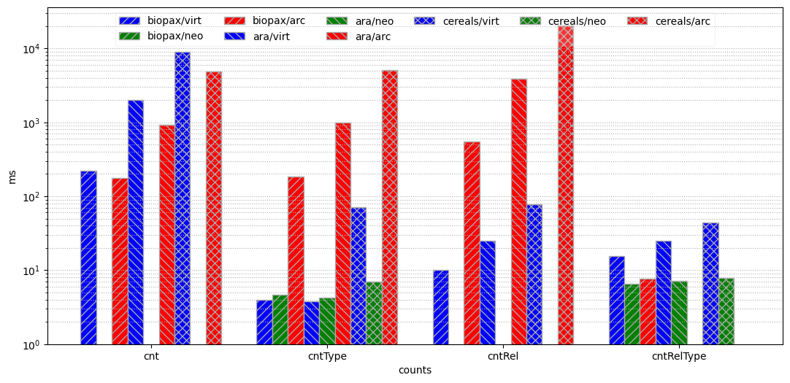
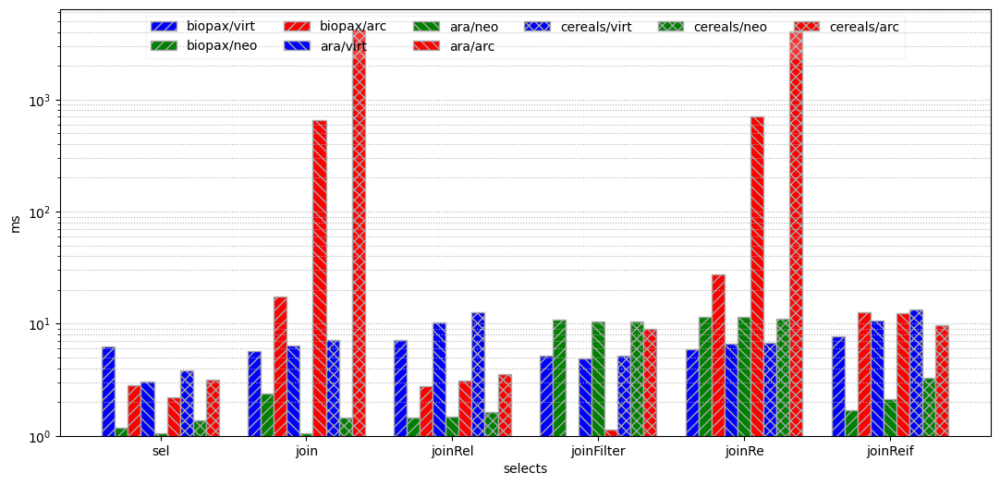
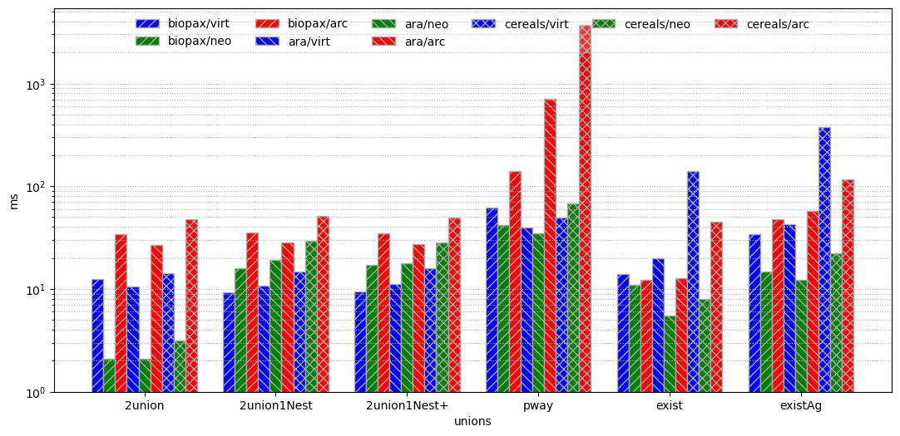
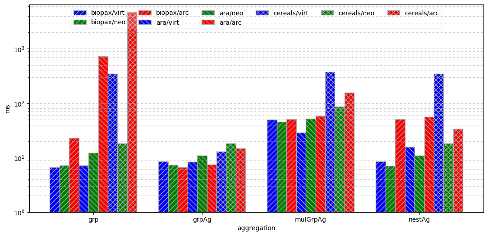
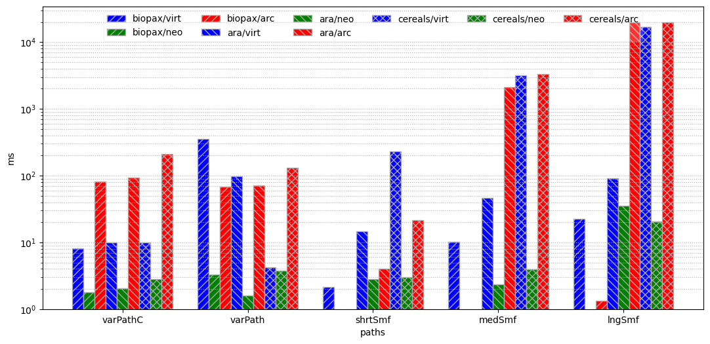

# Graph Database Benchmark, Query Performance Results


```python
# Some basic initialiasion
%matplotlib inline
import matplotlib.pyplot as plt
import pandas as pd
import numpy as np
from IPython.core.display import HTML

pd.set_option ( 'display.max_columns', 500 )
```

## Queries and Query Categories
As explained in the main README TODO, we have the following queries and query categories.


```python
# DO NOT EDIT MANUALLY! This was generated through: 
# mvn test -Dtest='QueryListTest#testJsonOut'
#
all_queries = {
  "counts": [
    "cnt",
    "cntType",
    "cntRel",
    "cntRelType"
  ],
  "selects": [
    "sel",
    "join",
    "joinRel",
    "joinFilter",
    "joinRe",
    "joinReif"
  ],
  "unions": [
    "2union",
    "2union1Nest",
    "2union1Nest+",
    "pway",
    "exist",
    "existAg"
  ],
  "aggregation": [
    "grp",
    "grpAg",
    "mulGrpAg",
    "nestAg"
  ],
  "paths": [
    "varPathC",
    "varPath",
    "shrtSmf",
    "medSmf",
    "lngSmf"
  ]
}
```

And we have tested them against different datasets and graph databases:


```python
# Internal ID -> Label used here
datasets = { 
  "biopax": "biopax",
  "arabidopsis": "ara",
  "poaceae": "cereals"
}

# internal ID => Label Used Here
databases = {
  "sparql": "virt",
   "neo": "neo",
   "arcade": "arc"
}
```

We ran all the queries for each combination of dataset/DB, and produded 1 result file for each of them:


```python
raw_results = {}
for dataset in datasets.keys():
  for db in databases.keys():
    combo = f"{dataset}-{db}"
    raw_res_path = f"{combo}-results.tsv"
    raw_res = pd.read_csv ( raw_res_path, sep = "\t" )
    raw_res.set_index ( "Name", inplace = True, drop = False )
    raw_results [ combo ] = raw_res
```

## Results summaries
In the tables below, a per-category summary of all the times taken in the various combinations of datasets and databases.

*Note: where sdev is '-', it's because no query succeded to complete before a set timeout of 20s.*


```python
# You can skip the following code if you're interested in the resulting tables only.

# Extracts the queries about a given group
def get_group_data ( raw_data, queries ):
  gdata = raw_data [ raw_data [ 'Name' ].isin ( queries ) ]
  gdata = gdata [ [ 'Name', 'AvgTime', 'STD' ] ] 
  return gdata

# Gets the summary table about a given group of queries
def get_summary_data ( qgroup ):
  gdata = pd.DataFrame ()
  queries = all_queries [ qgroup ]
  for dataset in datasets.keys ():
    for db in databases.keys():
      combo = f"{dataset}-{db}"

      qdata = raw_results [ combo ]
      qdata = get_group_data ( qdata, queries )

      was_empty = gdata.empty
      ylabel = datasets [ dataset ] + "/" + databases [ db ]
      gdata [ ylabel + " Time" ] = qdata [ "AvgTime" ].copy ()
      gdata [ ylabel + " sdev" ] = qdata [ "STD" ].copy ()

      if was_empty:
        gdata.set_index ( qdata [ "Name" ].copy (), inplace = True )
        gdata.index_name = "Queries"
  
  return gdata
  
data_summaries = {}      
for qgroup in all_queries.keys ():
  gdata = get_summary_data ( qgroup )
  data_summaries [ qgroup ] = gdata
  display ( HTML ( f"<h3>Group: {qgroup}</h3>" ) )
  display ( gdata )
```


<h3>Group: counts</h3>


<div>
<style scoped>
    .dataframe tbody tr th:only-of-type {
        vertical-align: middle;
    }

    .dataframe tbody tr th {
        vertical-align: top;
    }

    .dataframe thead th {
        text-align: right;
    }
</style>
<table border="1" class="dataframe">
  <thead>
    <tr style="text-align: right;">
      <th></th>
      <th>biopax/virt Time</th>
      <th>biopax/virt sdev</th>
      <th>biopax/neo Time</th>
      <th>biopax/neo sdev</th>
      <th>biopax/arc Time</th>
      <th>biopax/arc sdev</th>
      <th>ara/virt Time</th>
      <th>ara/virt sdev</th>
      <th>ara/neo Time</th>
      <th>ara/neo sdev</th>
      <th>ara/arc Time</th>
      <th>ara/arc sdev</th>
      <th>cereals/virt Time</th>
      <th>cereals/virt sdev</th>
      <th>cereals/neo Time</th>
      <th>cereals/neo sdev</th>
      <th>cereals/arc Time</th>
      <th>cereals/arc sdev</th>
    </tr>
    <tr>
      <th>Name</th>
      <th></th>
      <th></th>
      <th></th>
      <th></th>
      <th></th>
      <th></th>
      <th></th>
      <th></th>
      <th></th>
      <th></th>
      <th></th>
      <th></th>
      <th></th>
      <th></th>
      <th></th>
      <th></th>
      <th></th>
      <th></th>
    </tr>
  </thead>
  <tbody>
    <tr>
      <th>cnt</th>
      <td>220.441176</td>
      <td>7.650242</td>
      <td>0.413793</td>
      <td>0.494649</td>
      <td>177.125874</td>
      <td>15.744378</td>
      <td>2028.803150</td>
      <td>82.886616</td>
      <td>0.456140</td>
      <td>0.639972</td>
      <td>917.713178</td>
      <td>8.815996</td>
      <td>8943.053097</td>
      <td>58.197300</td>
      <td>0.295082</td>
      <td>1.080928</td>
      <td>4896.591241</td>
      <td>1539.757800</td>
    </tr>
    <tr>
      <th>cntType</th>
      <td>3.931034</td>
      <td>17.704200</td>
      <td>4.700935</td>
      <td>5.291886</td>
      <td>186.060870</td>
      <td>5.155966</td>
      <td>3.795455</td>
      <td>15.744011</td>
      <td>4.214286</td>
      <td>5.157685</td>
      <td>995.419118</td>
      <td>24.277884</td>
      <td>71.201681</td>
      <td>602.310419</td>
      <td>6.947826</td>
      <td>4.213270</td>
      <td>5072.715517</td>
      <td>1571.163041</td>
    </tr>
    <tr>
      <th>cntRel</th>
      <td>10.192661</td>
      <td>0.396210</td>
      <td>0.408000</td>
      <td>0.493441</td>
      <td>554.766667</td>
      <td>18.666347</td>
      <td>25.056911</td>
      <td>3.219563</td>
      <td>0.487603</td>
      <td>0.579018</td>
      <td>3881.508333</td>
      <td>48.566336</td>
      <td>77.172131</td>
      <td>1.231089</td>
      <td>0.225000</td>
      <td>1.305853</td>
      <td>20424.434109</td>
      <td>2995.374762</td>
    </tr>
    <tr>
      <th>cntRelType</th>
      <td>15.489209</td>
      <td>28.341951</td>
      <td>6.571429</td>
      <td>6.282701</td>
      <td>7.760274</td>
      <td>90.103489</td>
      <td>25.148438</td>
      <td>39.668725</td>
      <td>7.233645</td>
      <td>6.242852</td>
      <td>0.495413</td>
      <td>0.789091</td>
      <td>44.257732</td>
      <td>132.162170</td>
      <td>7.774648</td>
      <td>4.683447</td>
      <td>0.489583</td>
      <td>0.994668</td>
    </tr>
  </tbody>
</table>
</div>


<h3>Group: selects</h3>


<div>
<style scoped>
    .dataframe tbody tr th:only-of-type {
        vertical-align: middle;
    }

    .dataframe tbody tr th {
        vertical-align: top;
    }

    .dataframe thead th {
        text-align: right;
    }
</style>
<table border="1" class="dataframe">
  <thead>
    <tr style="text-align: right;">
      <th></th>
      <th>biopax/virt Time</th>
      <th>biopax/virt sdev</th>
      <th>biopax/neo Time</th>
      <th>biopax/neo sdev</th>
      <th>biopax/arc Time</th>
      <th>biopax/arc sdev</th>
      <th>ara/virt Time</th>
      <th>ara/virt sdev</th>
      <th>ara/neo Time</th>
      <th>ara/neo sdev</th>
      <th>ara/arc Time</th>
      <th>ara/arc sdev</th>
      <th>cereals/virt Time</th>
      <th>cereals/virt sdev</th>
      <th>cereals/neo Time</th>
      <th>cereals/neo sdev</th>
      <th>cereals/arc Time</th>
      <th>cereals/arc sdev</th>
    </tr>
    <tr>
      <th>Name</th>
      <th></th>
      <th></th>
      <th></th>
      <th></th>
      <th></th>
      <th></th>
      <th></th>
      <th></th>
      <th></th>
      <th></th>
      <th></th>
      <th></th>
      <th></th>
      <th></th>
      <th></th>
      <th></th>
      <th></th>
      <th></th>
    </tr>
  </thead>
  <tbody>
    <tr>
      <th>sel</th>
      <td>6.323529</td>
      <td>0.980418</td>
      <td>1.177778</td>
      <td>0.689653</td>
      <td>2.814159</td>
      <td>7.815448</td>
      <td>3.038760</td>
      <td>0.979502</td>
      <td>1.057377</td>
      <td>0.266572</td>
      <td>2.190476</td>
      <td>0.677812</td>
      <td>3.818841</td>
      <td>0.543515</td>
      <td>1.383333</td>
      <td>2.146654</td>
      <td>3.193548</td>
      <td>9.658121</td>
    </tr>
    <tr>
      <th>join</th>
      <td>5.664122</td>
      <td>0.708310</td>
      <td>2.395161</td>
      <td>15.084488</td>
      <td>17.535088</td>
      <td>1.130274</td>
      <td>6.400000</td>
      <td>0.861357</td>
      <td>1.059829</td>
      <td>0.302022</td>
      <td>655.873874</td>
      <td>7.773050</td>
      <td>7.147287</td>
      <td>0.469387</td>
      <td>1.452381</td>
      <td>4.738957</td>
      <td>4158.740741</td>
      <td>1802.350534</td>
    </tr>
    <tr>
      <th>joinRel</th>
      <td>7.180952</td>
      <td>0.386825</td>
      <td>1.442478</td>
      <td>0.865387</td>
      <td>2.792593</td>
      <td>1.072703</td>
      <td>10.252101</td>
      <td>2.030356</td>
      <td>1.475410</td>
      <td>0.980918</td>
      <td>3.131783</td>
      <td>1.127635</td>
      <td>12.707143</td>
      <td>0.605686</td>
      <td>1.639706</td>
      <td>3.054257</td>
      <td>3.552239</td>
      <td>1.235850</td>
    </tr>
    <tr>
      <th>joinFilter</th>
      <td>5.163636</td>
      <td>0.567099</td>
      <td>10.860656</td>
      <td>0.964798</td>
      <td>0.740741</td>
      <td>1.071032</td>
      <td>4.913793</td>
      <td>1.512665</td>
      <td>10.522124</td>
      <td>1.408503</td>
      <td>1.141593</td>
      <td>0.924539</td>
      <td>5.159292</td>
      <td>0.434379</td>
      <td>10.500000</td>
      <td>4.322578</td>
      <td>8.945736</td>
      <td>8.300330</td>
    </tr>
    <tr>
      <th>joinRe</th>
      <td>5.916667</td>
      <td>0.791575</td>
      <td>11.542373</td>
      <td>0.902457</td>
      <td>27.408333</td>
      <td>4.698464</td>
      <td>6.604651</td>
      <td>13.665318</td>
      <td>11.405405</td>
      <td>0.975876</td>
      <td>711.323308</td>
      <td>78.095081</td>
      <td>6.821138</td>
      <td>0.713253</td>
      <td>11.058824</td>
      <td>2.611234</td>
      <td>4070.148760</td>
      <td>737.270752</td>
    </tr>
    <tr>
      <th>joinReif</th>
      <td>7.752475</td>
      <td>0.555085</td>
      <td>1.698113</td>
      <td>0.571878</td>
      <td>12.571429</td>
      <td>83.101385</td>
      <td>10.712963</td>
      <td>1.260848</td>
      <td>2.133333</td>
      <td>0.401490</td>
      <td>12.348214</td>
      <td>75.335013</td>
      <td>13.308271</td>
      <td>0.653434</td>
      <td>3.268293</td>
      <td>7.159853</td>
      <td>9.661765</td>
      <td>5.148492</td>
    </tr>
  </tbody>
</table>
</div>


<h3>Group: unions</h3>


<div>
<style scoped>
    .dataframe tbody tr th:only-of-type {
        vertical-align: middle;
    }

    .dataframe tbody tr th {
        vertical-align: top;
    }

    .dataframe thead th {
        text-align: right;
    }
</style>
<table border="1" class="dataframe">
  <thead>
    <tr style="text-align: right;">
      <th></th>
      <th>biopax/virt Time</th>
      <th>biopax/virt sdev</th>
      <th>biopax/neo Time</th>
      <th>biopax/neo sdev</th>
      <th>biopax/arc Time</th>
      <th>biopax/arc sdev</th>
      <th>ara/virt Time</th>
      <th>ara/virt sdev</th>
      <th>ara/neo Time</th>
      <th>ara/neo sdev</th>
      <th>ara/arc Time</th>
      <th>ara/arc sdev</th>
      <th>cereals/virt Time</th>
      <th>cereals/virt sdev</th>
      <th>cereals/neo Time</th>
      <th>cereals/neo sdev</th>
      <th>cereals/arc Time</th>
      <th>cereals/arc sdev</th>
    </tr>
    <tr>
      <th>Name</th>
      <th></th>
      <th></th>
      <th></th>
      <th></th>
      <th></th>
      <th></th>
      <th></th>
      <th></th>
      <th></th>
      <th></th>
      <th></th>
      <th></th>
      <th></th>
      <th></th>
      <th></th>
      <th></th>
      <th></th>
      <th></th>
    </tr>
  </thead>
  <tbody>
    <tr>
      <th>2union</th>
      <td>12.563025</td>
      <td>0.576939</td>
      <td>2.093750</td>
      <td>0.788075</td>
      <td>34.021277</td>
      <td>2.824556</td>
      <td>10.568966</td>
      <td>1.439953</td>
      <td>2.100917</td>
      <td>1.254215</td>
      <td>26.688000</td>
      <td>0.901755</td>
      <td>14.250000</td>
      <td>0.455200</td>
      <td>3.127119</td>
      <td>10.226116</td>
      <td>47.842105</td>
      <td>13.955471</td>
    </tr>
    <tr>
      <th>2union1Nest</th>
      <td>9.275510</td>
      <td>0.471467</td>
      <td>15.968000</td>
      <td>1.331601</td>
      <td>35.360294</td>
      <td>11.564744</td>
      <td>10.776596</td>
      <td>1.108659</td>
      <td>19.338710</td>
      <td>1.081155</td>
      <td>28.500000</td>
      <td>14.958802</td>
      <td>14.676471</td>
      <td>1.127977</td>
      <td>29.434783</td>
      <td>12.845322</td>
      <td>51.604651</td>
      <td>20.603936</td>
    </tr>
    <tr>
      <th>2union1Nest+</th>
      <td>9.488550</td>
      <td>2.220071</td>
      <td>17.034783</td>
      <td>1.990902</td>
      <td>34.730496</td>
      <td>4.176258</td>
      <td>11.094828</td>
      <td>2.358992</td>
      <td>17.719008</td>
      <td>1.324281</td>
      <td>27.257143</td>
      <td>1.859726</td>
      <td>16.053097</td>
      <td>16.236995</td>
      <td>28.291262</td>
      <td>34.118488</td>
      <td>49.222222</td>
      <td>16.513698</td>
    </tr>
    <tr>
      <th>pway</th>
      <td>61.452381</td>
      <td>1.077829</td>
      <td>41.680000</td>
      <td>1.771640</td>
      <td>141.297521</td>
      <td>28.614287</td>
      <td>39.323232</td>
      <td>1.412974</td>
      <td>34.664179</td>
      <td>1.232053</td>
      <td>712.776786</td>
      <td>159.023807</td>
      <td>49.883929</td>
      <td>0.581169</td>
      <td>67.892473</td>
      <td>14.867138</td>
      <td>3725.034783</td>
      <td>1237.572900</td>
    </tr>
    <tr>
      <th>exist</th>
      <td>14.056075</td>
      <td>0.563543</td>
      <td>11.015504</td>
      <td>0.847648</td>
      <td>12.269231</td>
      <td>16.206334</td>
      <td>19.785714</td>
      <td>1.487530</td>
      <td>5.543103</td>
      <td>0.677492</td>
      <td>12.669643</td>
      <td>0.809720</td>
      <td>141.253623</td>
      <td>0.616815</td>
      <td>8.025000</td>
      <td>14.766225</td>
      <td>44.758065</td>
      <td>20.835543</td>
    </tr>
    <tr>
      <th>existAg</th>
      <td>34.396396</td>
      <td>0.607218</td>
      <td>14.716667</td>
      <td>0.980339</td>
      <td>47.284404</td>
      <td>2.928442</td>
      <td>42.780488</td>
      <td>1.944039</td>
      <td>12.342105</td>
      <td>0.762262</td>
      <td>57.297030</td>
      <td>8.412544</td>
      <td>379.893204</td>
      <td>0.999143</td>
      <td>22.327869</td>
      <td>26.320166</td>
      <td>116.020202</td>
      <td>47.147398</td>
    </tr>
  </tbody>
</table>
</div>


<h3>Group: aggregation</h3>


<div>
<style scoped>
    .dataframe tbody tr th:only-of-type {
        vertical-align: middle;
    }

    .dataframe tbody tr th {
        vertical-align: top;
    }

    .dataframe thead th {
        text-align: right;
    }
</style>
<table border="1" class="dataframe">
  <thead>
    <tr style="text-align: right;">
      <th></th>
      <th>biopax/virt Time</th>
      <th>biopax/virt sdev</th>
      <th>biopax/neo Time</th>
      <th>biopax/neo sdev</th>
      <th>biopax/arc Time</th>
      <th>biopax/arc sdev</th>
      <th>ara/virt Time</th>
      <th>ara/virt sdev</th>
      <th>ara/neo Time</th>
      <th>ara/neo sdev</th>
      <th>ara/arc Time</th>
      <th>ara/arc sdev</th>
      <th>cereals/virt Time</th>
      <th>cereals/virt sdev</th>
      <th>cereals/neo Time</th>
      <th>cereals/neo sdev</th>
      <th>cereals/arc Time</th>
      <th>cereals/arc sdev</th>
    </tr>
    <tr>
      <th>Name</th>
      <th></th>
      <th></th>
      <th></th>
      <th></th>
      <th></th>
      <th></th>
      <th></th>
      <th></th>
      <th></th>
      <th></th>
      <th></th>
      <th></th>
      <th></th>
      <th></th>
      <th></th>
      <th></th>
      <th></th>
      <th></th>
    </tr>
  </thead>
  <tbody>
    <tr>
      <th>grp</th>
      <td>6.689655</td>
      <td>0.565897</td>
      <td>7.238411</td>
      <td>0.607822</td>
      <td>22.762712</td>
      <td>1.791137</td>
      <td>7.201613</td>
      <td>2.371853</td>
      <td>12.237288</td>
      <td>16.713615</td>
      <td>724.880734</td>
      <td>4.837593</td>
      <td>346.773109</td>
      <td>0.969335</td>
      <td>18.345794</td>
      <td>4.629892</td>
      <td>4704.354331</td>
      <td>1628.997152</td>
    </tr>
    <tr>
      <th>grpAg</th>
      <td>8.583333</td>
      <td>1.132731</td>
      <td>7.299145</td>
      <td>0.698088</td>
      <td>6.613861</td>
      <td>1.954330</td>
      <td>8.319588</td>
      <td>0.810689</td>
      <td>10.885246</td>
      <td>0.919906</td>
      <td>7.443478</td>
      <td>2.506802</td>
      <td>13.067961</td>
      <td>12.024699</td>
      <td>18.300752</td>
      <td>4.339713</td>
      <td>14.680412</td>
      <td>11.004304</td>
    </tr>
    <tr>
      <th>mulGrpAg</th>
      <td>50.000000</td>
      <td>0.995927</td>
      <td>45.274074</td>
      <td>2.244162</td>
      <td>50.504673</td>
      <td>5.151248</td>
      <td>29.008403</td>
      <td>1.654454</td>
      <td>51.971223</td>
      <td>1.769068</td>
      <td>58.500000</td>
      <td>11.618311</td>
      <td>376.944444</td>
      <td>0.721283</td>
      <td>87.000000</td>
      <td>17.525625</td>
      <td>155.907407</td>
      <td>60.228775</td>
    </tr>
    <tr>
      <th>nestAg</th>
      <td>8.595420</td>
      <td>0.617422</td>
      <td>7.108911</td>
      <td>0.786142</td>
      <td>51.229358</td>
      <td>3.537191</td>
      <td>15.782258</td>
      <td>2.062284</td>
      <td>10.875969</td>
      <td>1.346336</td>
      <td>56.308725</td>
      <td>2.013130</td>
      <td>348.768595</td>
      <td>0.680200</td>
      <td>18.272727</td>
      <td>5.665686</td>
      <td>33.392593</td>
      <td>15.793016</td>
    </tr>
  </tbody>
</table>
</div>


<h3>Group: paths</h3>


<div>
<style scoped>
    .dataframe tbody tr th:only-of-type {
        vertical-align: middle;
    }

    .dataframe tbody tr th {
        vertical-align: top;
    }

    .dataframe thead th {
        text-align: right;
    }
</style>
<table border="1" class="dataframe">
  <thead>
    <tr style="text-align: right;">
      <th></th>
      <th>biopax/virt Time</th>
      <th>biopax/virt sdev</th>
      <th>biopax/neo Time</th>
      <th>biopax/neo sdev</th>
      <th>biopax/arc Time</th>
      <th>biopax/arc sdev</th>
      <th>ara/virt Time</th>
      <th>ara/virt sdev</th>
      <th>ara/neo Time</th>
      <th>ara/neo sdev</th>
      <th>ara/arc Time</th>
      <th>ara/arc sdev</th>
      <th>cereals/virt Time</th>
      <th>cereals/virt sdev</th>
      <th>cereals/neo Time</th>
      <th>cereals/neo sdev</th>
      <th>cereals/arc Time</th>
      <th>cereals/arc sdev</th>
    </tr>
    <tr>
      <th>Name</th>
      <th></th>
      <th></th>
      <th></th>
      <th></th>
      <th></th>
      <th></th>
      <th></th>
      <th></th>
      <th></th>
      <th></th>
      <th></th>
      <th></th>
      <th></th>
      <th></th>
      <th></th>
      <th></th>
      <th></th>
      <th></th>
    </tr>
  </thead>
  <tbody>
    <tr>
      <th>varPathC</th>
      <td>8.155039</td>
      <td>14.082597</td>
      <td>1.781250</td>
      <td>1.097395</td>
      <td>82.208333</td>
      <td>37.487005</td>
      <td>10.000000</td>
      <td>3.297883</td>
      <td>2.039370</td>
      <td>1.217606</td>
      <td>92.681416</td>
      <td>39.223095</td>
      <td>9.858333</td>
      <td>3.358911</td>
      <td>2.798450</td>
      <td>5.287633</td>
      <td>211.457627</td>
      <td>177.929768</td>
    </tr>
    <tr>
      <th>varPath</th>
      <td>357.793388</td>
      <td>10.052294</td>
      <td>3.310078</td>
      <td>0.647090</td>
      <td>67.917355</td>
      <td>8.572812</td>
      <td>98.305344</td>
      <td>2.950601</td>
      <td>1.609091</td>
      <td>0.591925</td>
      <td>70.511628</td>
      <td>5.661156</td>
      <td>4.214876</td>
      <td>0.432177</td>
      <td>3.803419</td>
      <td>11.332924</td>
      <td>131.681034</td>
      <td>52.865309</td>
    </tr>
    <tr>
      <th>shrtSmf</th>
      <td>2.140496</td>
      <td>0.348946</td>
      <td>0.708333</td>
      <td>0.570947</td>
      <td>0.409524</td>
      <td>1.071441</td>
      <td>14.679245</td>
      <td>2.765595</td>
      <td>2.781513</td>
      <td>0.506896</td>
      <td>4.052632</td>
      <td>6.688839</td>
      <td>229.125984</td>
      <td>1.657078</td>
      <td>3.038095</td>
      <td>8.605593</td>
      <td>21.293103</td>
      <td>8.118703</td>
    </tr>
    <tr>
      <th>medSmf</th>
      <td>10.211382</td>
      <td>0.617398</td>
      <td>0.557252</td>
      <td>0.556919</td>
      <td>0.816667</td>
      <td>1.587680</td>
      <td>46.255814</td>
      <td>6.497931</td>
      <td>2.355769</td>
      <td>1.525946</td>
      <td>2094.091743</td>
      <td>38.902666</td>
      <td>3148.770992</td>
      <td>3.001448</td>
      <td>3.962963</td>
      <td>11.053741</td>
      <td>3312.796610</td>
      <td>1290.639625</td>
    </tr>
    <tr>
      <th>lngSmf</th>
      <td>22.276923</td>
      <td>0.622764</td>
      <td>0.690000</td>
      <td>0.761378</td>
      <td>1.333333</td>
      <td>1.224143</td>
      <td>92.201613</td>
      <td>2.482393</td>
      <td>35.230159</td>
      <td>1.153518</td>
      <td>inf</td>
      <td>-</td>
      <td>17004.155963</td>
      <td>29.184018</td>
      <td>20.548387</td>
      <td>104.261269</td>
      <td>inf</td>
      <td>-</td>
    </tr>
  </tbody>
</table>
</div>


## Result Charts

We can use the tables above to show the data in bar charts. Again, we're showing one chart per category.


```python
# You can skip the following code if you're interested in the resulting charts only.

from matplotlib.ticker import ScalarFormatter

# Assigns bar colors based on the DB
def get_db_color ( db ):
  colors = { "sparql": "Blue", "neo": "Green", "arcade": "Red" }
  return colors [ db ]

# Assigns bar hatch patterns based on the dataset 
def get_dataset_hatch ( dset ):
  hatches = { "biopax": "///", "arabidopsis": "\\\\\\", "poaceae": "XXX" }
  return hatches [ dset ]

"""
Gets the x vector to locate the ibar (starts at 0) correctly, assuming you want have nbars 
vertical bars of each of the nlabels labels, and all the bars will take wbar_total units of 
width, where the bar groups (ie, each label) are spaced 1 unit from each other.

Returns (the x vector, the single bar width, the next ibar ).

The method is based on:
https://matplotlib.org/3.1.1/gallery/lines_bars_and_markers/barchart.html#sphx-glr-gallery-lines-bars-and-markers-barchart-py

TODO: move to an imported module.
"""
def bar_get_xs ( ibar, nbars, nlabels, wbar_total = 0.8 ):
  x = np.arange ( nlabels )
  # wbar_total = 0.8 # Because x = 0, 1, 2, you've a total of 1
  wbar = wbar_total / nbars 
  xi = x - wbar_total / 2  + wbar / 2 + ibar * wbar
  return (xi, wbar, ibar + 1)

"""
Sets the x ticks that match what was computed by get_bar_xs()
"""
def bar_set_xticks ( ax, nlabels ):
  x = np.arange ( nlabels )
  ax.set_xticks ( x )

"""
Draws the bar chart for a given query group
"""
def group_chart ( qgroup ):
  gdata = data_summaries [ qgroup ]
    
  # In these cases, all queries timed out
  gdata = gdata.replace ( np.inf, 20000 ) 

  fig, ax = plt.subplots()
  nbars = len ( datasets.keys () ) * len ( databases.keys() )
  nlabels = len ( gdata.index )
  ibar = 0
    
  for dataset in datasets.keys ():
    for db in databases.keys():
      combo_prefx = datasets [ dataset ] + "/" + databases [ db ]
      ylabel = combo_prefx
      
      yid = combo_prefx + " Time"
      y = gdata [ yid ]

      # Tried to show errors, but the log scale distorts and confuse things, plus
      # <1 values yield errors
      #yerr_id = combo_prefx + " sdev"
      #yerr = gdata [ yerr_id ].tolist ()
        
      ycolor = get_db_color ( db )
      yhatch = get_dataset_hatch ( dataset )

      xi, wbar, ibar = bar_get_xs ( ibar, nbars, nlabels )
        
      ax.bar ( xi, y, width = wbar, label = ylabel, 
        color = ycolor, edgecolor = "DarkGrey", hatch = yhatch, log = True )

  bar_set_xticks ( ax, nlabels )
  ax.set_xticklabels ( gdata.index )

  ax.set_xlabel ( qgroup )
  ax.set_ylabel ( "ms" )

  # To cope with y = 0 in log scale
  ax.set_ylim ( ymin = 1 )

  # No sci notation, but 10000 takes more space
  #ax.yaxis.set_major_formatter ( ScalarFormatter () ) 

  ax.grid ( axis = "y", which = "both", linestyle = 'dotted' )

  ax.legend ( loc = "upper center", ncol = 6, framealpha = 0.2 );
    
  # Give it a good size
  ax.figure.set_size_inches ( 13, 6 )

  # And save!
  img_fmt = "svg"
  ax.figure.savefig ( f"querying-results-{qgroup}." + img_fmt, format = img_fmt )  


for qgroup in all_queries.keys ():
  group_chart ( qgroup )
```


    

    


    

    


    

    


    

    


    

    

